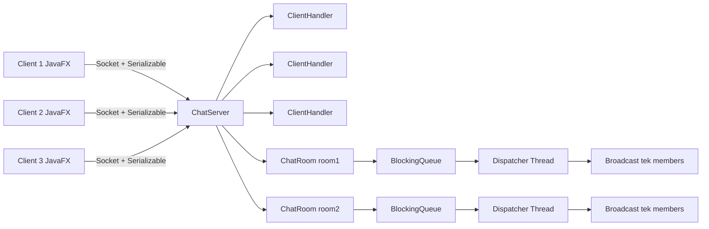
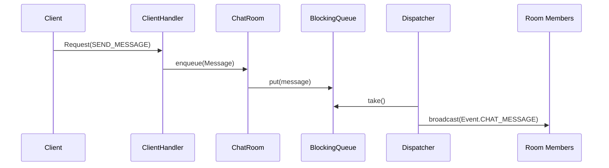

# Distributed Chat System me Rooms dhe Message Queue

## 1) Udhëzime për ekzekutim

### Kërkesat
- Java 17+ (rekomandohet 17 ose 21)
- Maven
- JavaFX (nëse nuk është i integruar në IDE)

### Ekzekutimi i serverit
1. Hap projektin në IntelliJ/Eclipse.
2. Run klasën:
    - `server.ChatServer`
3. Serveri nis në portin `5555` (ose sipas konfigurimit).

### Ekzekutimi i klientëve
1. Run klasën:
    - `client.ChatClientApp`
2. Hap minimum **3 instance** të klientit.
3. Në secilin:
    - Host: `localhost` (ose IP e serverit)
    - Port: `5555`
    - Username unik (p.sh. user1, user2, user3)

### Test i shpejtë
1. Client 1: krijo room `room1`
2. Client 2 dhe 3: join `room1`
3. Dërgo mesazhe nga secili klient
4. Verifiko:
    - Mesazhet duken në kohë reale
    - Shfaqet timestamp + sender + room
    - Nuk lejohet username i dyfishtë

---

## 2) Përshkrim i arkitekturës

Sistemi përbëhet nga:
- **Server qendror**
- **Shumë klientë (JavaFX GUI)**

### Komponentët kryesorë

#### Server
- `ChatServer`
    - Pranon lidhjet (`ServerSocket`)
    - Menaxhon:
        - `clientsByUsername`
        - `roomsByName`
- `ClientHandler` (thread për çdo klient)
    - Pranon kërkesa (`LOGIN`, `CREATE_ROOM`, `JOIN_ROOM`, `LEAVE_ROOM`, `SEND_MESSAGE`, `LIST_ROOMS`)
    - Menaxhon gjendjen e klientit
- `ChatRoom`
    - Ka `BlockingQueue<Message>`
    - Ka thread dedikuar për shpërndarje (`dispatcher`)
    - Mban listën e anëtarëve të room-it
- `ClientSession`
    - Përfaqëson klientin e lidhur
    - Dërgon `Event/Response` në mënyrë thread-safe
- `Message`
    - `sender`, `roomName`, `content`, `timestamp`

#### Client
- `ChatClientApp` (JavaFX)
    - UI për login, rooms, chat
- `NetworkClient`
    - Lidhet me serverin me `Socket`
    - Thread i marrjes së eventeve (push-based)

### Sinkronizimi
- Përdoret `ReentrantLock` për strukturat e përbashkëta në server.
- Dërgimi i objekteve te klienti bëhet me lock për të shmangur korruptimin e stream-it.

### Rrjedha e mesazhit
1. Klienti dërgon `SEND_MESSAGE`
2. Serveri krijon `Message`
3. Mesazhi futet në `BlockingQueue` të room-it
4. Thread-i i room-it e merr me `take()`
5. Bëhet broadcast te të gjithë anëtarët e room-it (real-time, pa polling)

---

## 3) Problemet e hasura dhe zgjidhjet

1. **Socket closed / invalid type code**
    - Shkak: shkrime paralele në `ObjectOutputStream` pa sinkronizim unik.
    - Zgjidhje: dërgimi i `Response` dhe `Event` vetëm përmes metodave të sinkronizuara në `ClientSession`.

2. **Username ekziston tashmë**
    - Shkak: klienti vendoste `username` lokal pa pritur `LOGIN success`.
    - Zgjidhje: `username` vendoset vetëm pasi serveri kthen sukses.

3. **Room-et zhdukeshin nga lista**
    - Shkak: room-et fshiheshin automatikisht kur mbeteshin bosh.
    - Zgjidhje: room-et ruhen në server (nuk fshihen automatikisht), ose kontroll i qartë i logjikës së fshirjes.

4. **UI nuk tregonte qartë room-in aktiv**
    - Zgjidhje: u shtua `Room aktiv: <name>` në krye të chat-it dhe status bar.

---

## 4) Diagram i sistemit

### 4.1 Diagram arkitekture (komponentë)

### 4.2 Sequence diagram (dërgimi i mesazhit)

---

### Gentrit Ahmeti & Drin Prekaj